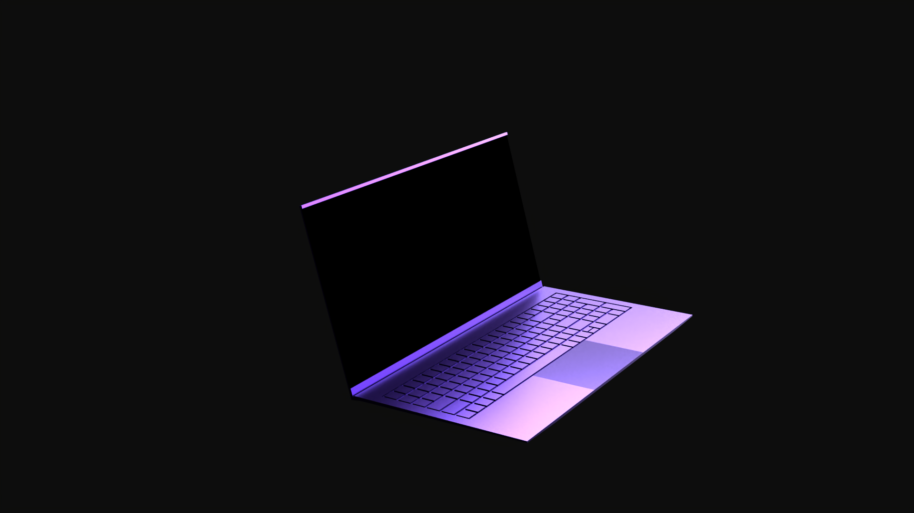
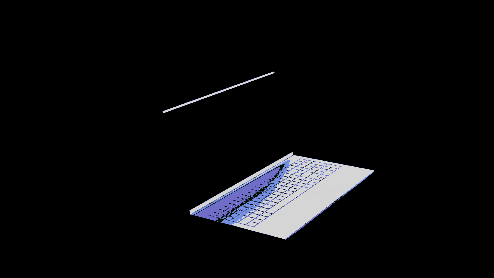

# img2mpx - Supaplex Level Maker(in a sense)


-success?style=flat>)


```
██╗███╗   ███╗ ██████╗ ██████╗ ███╗   ███╗██████╗ ██╗  ██╗
██║████╗ ████║██╔════╝ ╚════██╗████╗ ████║██╔══██╗╚██╗██╔╝
██║██╔████╔██║██║  ███╗ █████╔╝██╔████╔██║██████╔╝ ╚███╔╝
██║██║╚██╔╝██║██║   ██║██╔═══╝ ██║╚██╔╝██║██╔═══╝  ██╔██╗
██║██║ ╚═╝ ██║╚██████╔╝███████╗██║ ╚═╝ ██║██║     ██╔╝ ██╗
╚═╝╚═╝     ╚═╝ ╚═════╝ ╚══════╝╚═╝     ╚═╝╚═╝     ╚═╝  ╚═╝
```

---

## What is this?

Converts images into playable Supaplex levels through tile mapping and color matching. Includes a GUI because CLIs are for cowards.

<details><summary><code>Translation for normal people</code></summary>
<code>Takes your images, breaks them into tiles, maps colors, outputs .mpx file you can play in Supaplex</code>
</details>

---

## Conversion Results

Input Image:

Converted Level Preview (tile size: 5x5px):


---

## Features

| Feature                   | Description                                  |
| ------------------------- | -------------------------------------------- |
| **Image → Level**         | Converts PNG/JPG/BMP/GIF to .mpx format(duh) |
| **Color Palette Control** | Adjustable color palette reduction           |
| **Preview**               | See how the level will look in-game          |
| **Dark Theme**            | Because it's 2025 and light mode is a crime  |

---

## Installation

```bash
git clone https://github.com/Endobotm/supaplex-img-2-mpx.git
cd supaplex-img-2-mpx
pip install -r requirements.txt
cd preview-rs
python -m venv .env
pip install maturin
maturin develop
cd ..
pip install -e ./preview-rs
python img2mpx.py
```

**Requirements:**

```
[the provided tiles folder]
tkinter (usually pre-installed)
Pillow
numpy
colorama
sv-ttk
pywinstyles
(some more im too lazy to list out... just check the fucking file)
```

---

## Usage

1. **Select Image** - Click "Select Image", pick your file
2. **Configure** - Set level name, filename, palette colors
3. **Convert** - Hit "Start Conversion"
4. **Play** - Load the .mpx file in Supaplex

**Pro Tips:**

- Keep images under 2000×2000 for best performance
- Set colour palette to 256 for best colour accuracy
- Think with your brain and not your asshole
- Drink water BEFORE coffee. Caffeine on empty stomach = anxiety speedrun. Ask me how I know.
- Nobody reads README files completely. You're probably skimming this right now.
- Dust kills more PCs than viruses. Clean your fans. Yes, right now. I'll wait.

---

## How It Works

**The Pipeline:**

1. **Palette Reduction** - Reduces image to N colors (adaptive quantization...idk why you do this but it seems to help...somewhat)
2. **Tile Loading** - Loads Supaplex tileset, calculates average RGB per tile
3. **Color Matching** - Maps each pixel to closest tile via Euclidean distance
4. **MPX Encoding** - Writes binary .mpx format (reverse-engineered through trial/error)
5. **Preview Generation** - Builds preview with dynamic tile scaling (preview generator is a separate module written in rust for performance)

**Technical Details:**

- Uses PIL for image processing
- k-means clustering for tile color detection
- Floyd-Steinberg dithering for palette reduction
- LAB encoding for better colour matching
- Delta-E for even more accurate colour matching, accounts for how it appears from a distance...I think

---

## Warnings

⚠️ **DO NOT:**

- Feed this 8K+ images (it will work but your RAM will cry)
- Use gigapixel images (see above)
- Expect perfect color accuracy (I tried my best dawg, you can only do so much)
- Blame me if Supaplex crashes (mate shit was meant for puzzles not art)
- Feed this questionable content (it will work, but you will be looked down upon)

⚠️ **For the curious:**

- No, you cannot feed it a 51 trillion pixel image
- If you try, I will convert YOU into tiles
- Yes, this is a threat

---

## Known Issues

- Some tiles are 49×50 instead of 50×50 (oopsies)
- Very large images take time (it's not frozen, just thinking)
- Progress bar is cosmetic (but it looks cool)

---

## Credits

**Code Sources:**

- Stack Overflow (colour matching, image handling, etc)
- SPFIX63a.txt (MPX spec sheet)
- Trial and error (most of it)
- Coffee (fuel)

**Polishing:**

- Me
- Reddit

**Inspiration:**

- Supaplex (the game)
- Spite (the motivation)
- Boredom (the catalyst)

## License

Do whatever you want with this. If it breaks, that's on you.  
If you make money from it, buy me coffee.  
If you improve it, submit a PR (or don't, idfc).

---

<div align="center">
```
Made with pixel-perfect OCD and questionable design decisions.
```

</div>
<div align="center">
```
And Remember; don't vibe code lads, that ain't code
```

</div>
